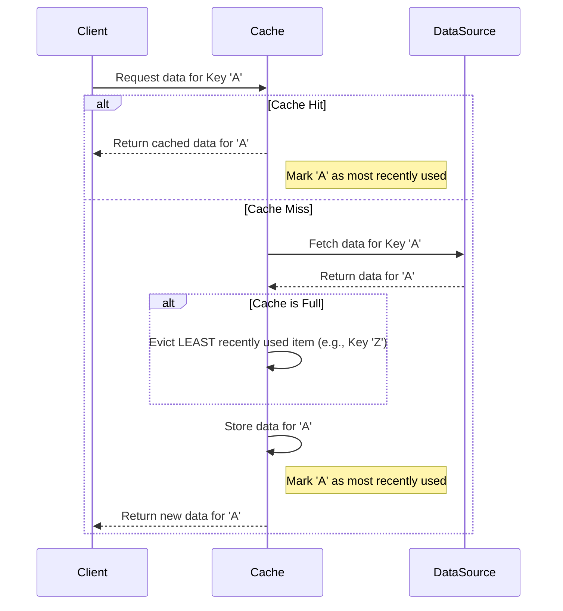
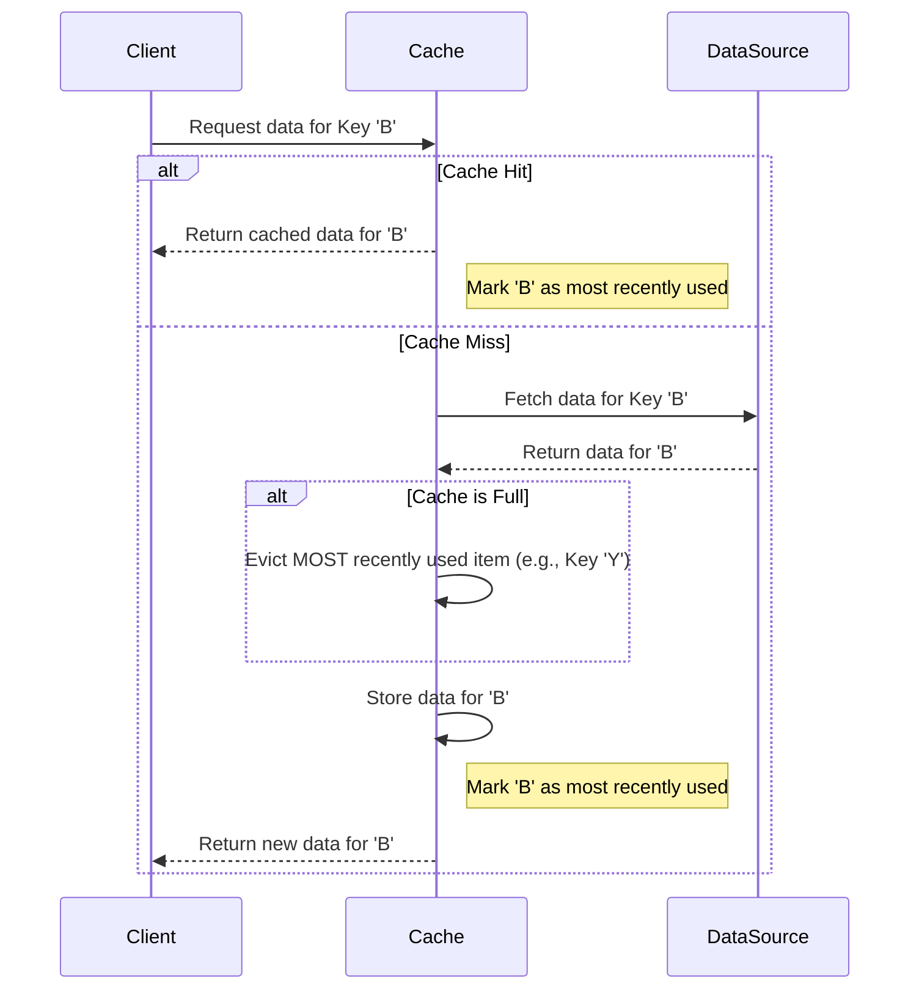

# Cache Replacement Algorithm Sequence Diagrams

This document contains sequence diagrams illustrating the logic for LRU (Least Recently Used) and MRU (Most Recently Used) cache replacement algorithms. You can copy and paste this Markdown code into Typora or any other editor that supports Mermaid diagrams.

---

## Least Recently Used (LRU)

In this scenario, when the cache is full and a new item needs to be added, the cache evicts the item that has not been accessed for the longest amount of time.

---

## Most Recently Used (MRU)

In this scenario, when the cache is full and a new item needs to be added, the cache evicts the item that was most recently accessed. This strategy can be effective for workloads where older items are more likely to be re-used.

