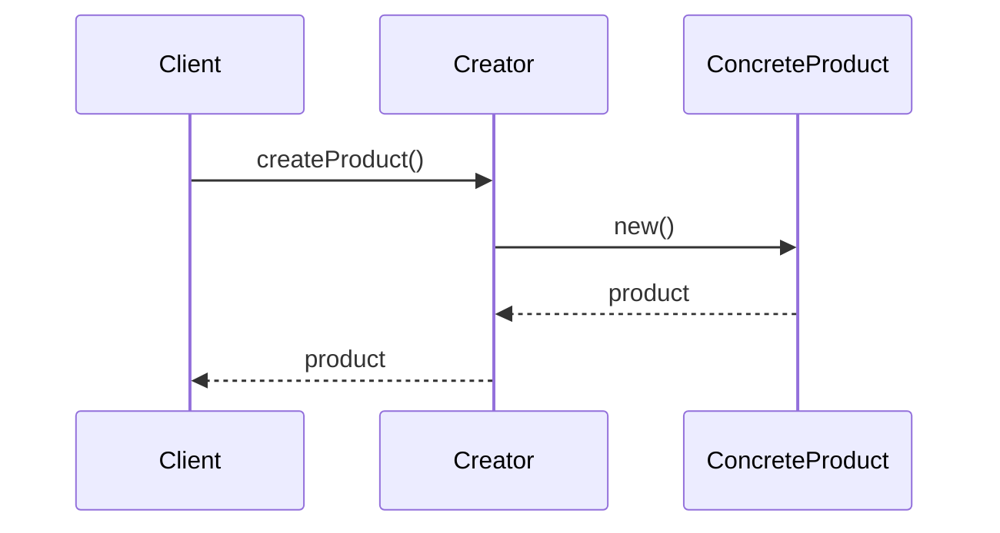

# Factory Pattern

The Factory pattern is a creational pattern that provides an interface for creating objects in a superclass, but allows subclasses to alter the type of objects that will be created. This pattern is useful when a class cannot anticipate the class of objects it must create.

## When to Use It

*   When a class doesn't know which class of objects it needs to create.
*   When a class wants its subclasses to specify the objects it creates.
*   When you want to provide a library of objects and you want to show only their interface, not their implementation.

## Sequence Diagram

Here is a sequence diagram illustrating the Factory pattern:

