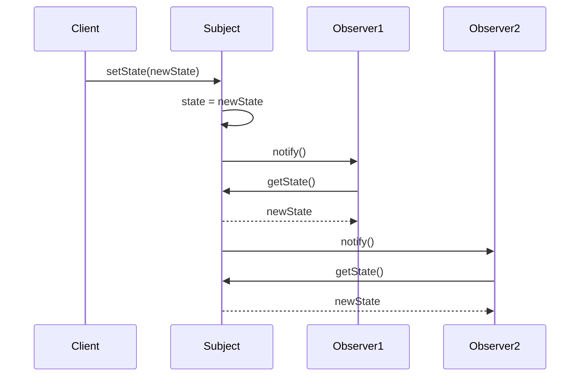

# Observer Pattern

The Observer pattern is a behavioral design pattern that defines a one-to-many dependency between objects. When one object (the subject) changes its state, all of its dependents (the observers) are notified and updated automatically.

## When to Use It

*   When a change in one object requires changing others, and you don't know how many objects need to be changed.
*   When an object should be able to notify other objects without making assumptions about who those objects are.
*   When you want to create a loose coupling between objects.

## Sequence Diagram

This sequence diagram shows how the Observer pattern works:

