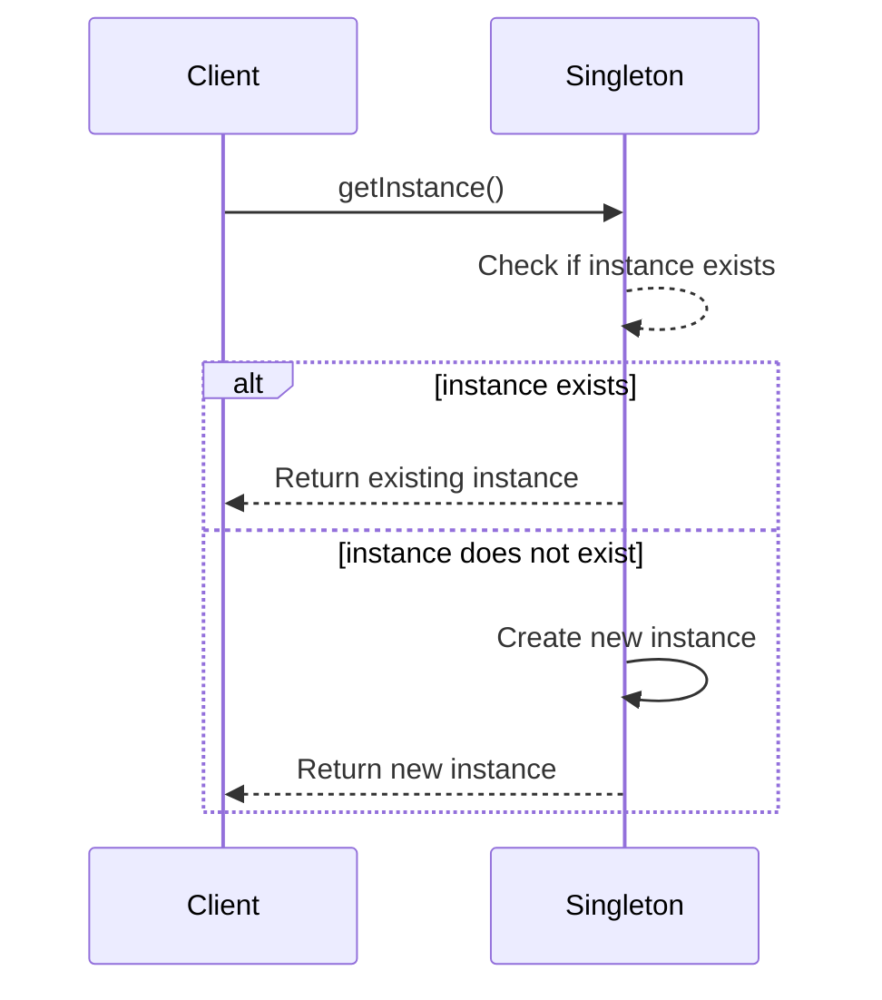

# Singleton Pattern

The Singleton pattern ensures that a class has only one instance and provides a global point of access to it. This is useful when exactly one object is needed to coordinate actions across the system.

## When to Use It

*   When you need to ensure that only one instance of a class exists.
*   When you need a global point of access to that instance.
*   For resources that are expensive to create, such as a database connection or a network service.

## Sequence Diagram

Here is a sequence diagram showing how the Singleton pattern works:

